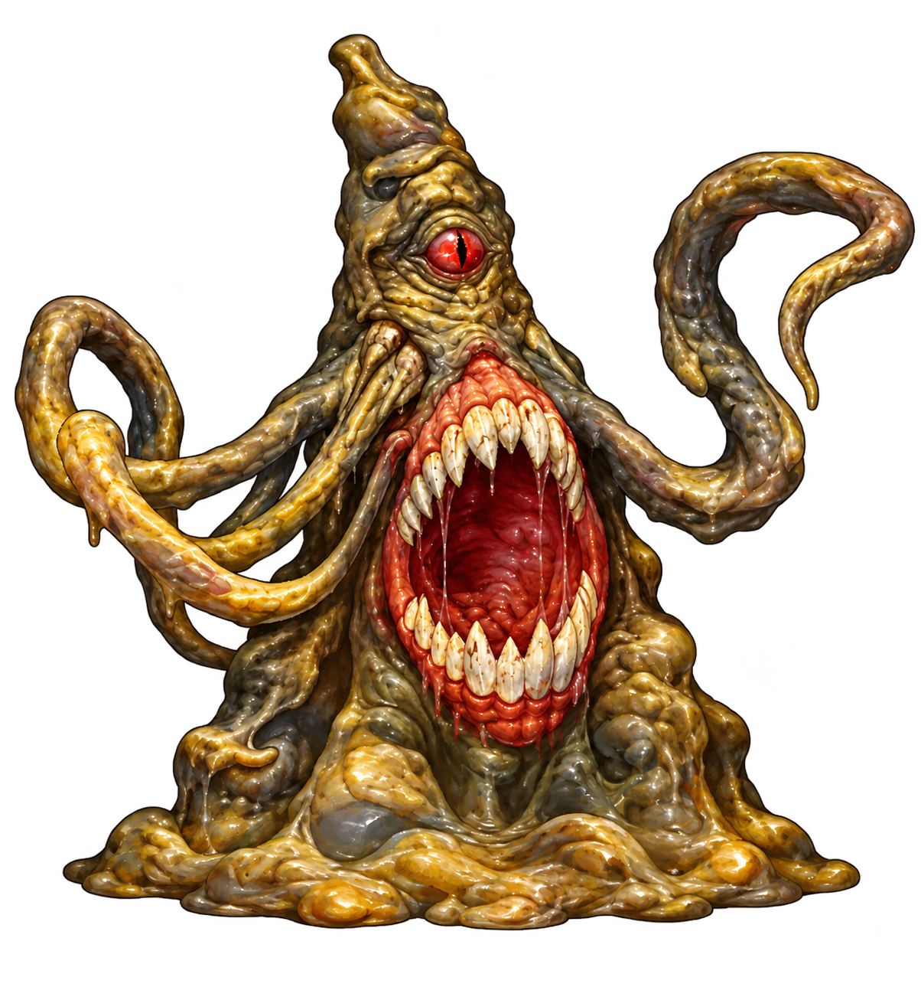
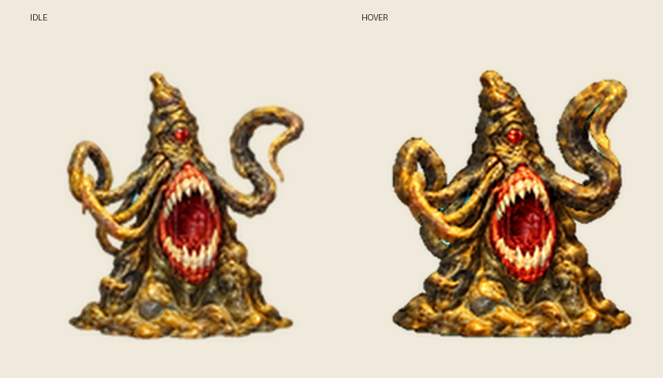
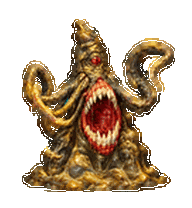
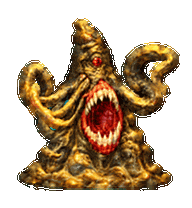

# Yochlol, Handmaiden of Lolth

I made this unofficial Codex desktop pet from two images I wanted to bring together: the malformed Yochlol of *Menzoberranzan* (1994), and the sculpted detail of my 2015 Roper miniature. I wanted the game’s grotesque silhouette to keep its weight and unease, while the physical figure informed the folds, irregular surface and pooled flesh. She stays heavy on the ground, with one small scarlet eye above an enormous red mouth and eight uneven pseudopods that move at their own pace.

## In the lore, and in Menzoberranzan

I began with the AD&D 2nd Edition Yochlol, a handmaiden of Lolth whose amorphous form has one eye and eight pseudopods. The [Complete Compendium](https://www.completecompendium.com/appendix/yochlolu/) gathers the source references for her lore and other forms. For this pet I stayed with the amorphous creature: dirty grey-brown, olive and muted ochre flesh, a small eye set high above an enormous vertical mouth, irregular ivory teeth and a broad mass pooled against the ground.

The 1994 game gave me a particular Yochlol to think about. Azarell first appears as an elf, then reveals her true form; later, she returns as an ally and betrays the party during the carrion crawler encounter. I drew on that shift in allegiance for the pet’s watchful, withholding manner. The [original Menzoberranzan cluebook](https://www.mocagh.org/ssi/menzoberranzan-hintbook.pdf) and a [CD-ROM-based walkthrough with encounter screenshots](https://www.swordsandsoftware.com/menzo.php) record her appearances.

In the resource audit I gathered, YOCHOL appears in NPCS.DAT as graphics record 102, with a 34-slot RES3 range from 102 through 135, followed by the Derro record at 136. My notes also mark small placeholder entries within that bank. I have not decoded the original sprite frames, so I treat those numbers as a map of the resource layout rather than evidence that every pose has been recovered.

The photograph here shows my 2015 Roper miniature, numbered 28/55. I used its sculptural detail and tactile surface as one part of the design, fused with the older game’s grotesque Yochlol shape. The resulting pet is my own interpretation of those sources.

## How her animation reads

Her idle loop keeps the pooled base in one place while individual pseudopods flex. The current Hatch Pet prompt maps hover to the jumping row. Yochlol keeps her base, scale, and resting tentacles fixed while one existing outer pseudopod lifts and settles; the body stays planted, and the animation does not add another limb. The waving row gives one pseudopod a slower, restrained greeting. During work and review she remains intent and planted; waiting extends a limb toward the viewer, failure tightens her mouth and limbs, and drag movement pulls her mass laterally. [The state prompt is in OpenAI's public skill source](https://github.com/openai/skills/blob/main/skills/.curated/hatch-pet/scripts/prepare_pet_run.py).

The custom-pet package is deliberately limited to its supported manifest and sprite sheet. Codex chooses when to play its fixed animation states; a pet cannot add its own click handlers, dialogue runtime or persistent mood through this package. The [Codex pet contract](https://github.com/openai/skills/blob/main/skills/.curated/hatch-pet/references/codex-pet-contract.md) describes the local files and sprite format. The open [custom-pet lifecycle request](https://github.com/openai/codex/issues/29932) describes the current limits around runtime state. An optional dialogue and interaction demo lives in [extras/companion-demo](extras/companion-demo); it is a developer experiment, not part of installation.

## Install

On Windows, download or clone this repository, then run install.ps1 from its root. It copies pet.json and spritesheet.webp to %USERPROFILE%\.codex\pets\yochlol\, or to %CODEX_HOME%\pets\yochlol\ when CODEX_HOME is set. Restart Codex or refresh the pet picker, then select Yochlol.

On macOS or Linux, copy the two files from pet/ into ~/.codex/pets/yochlol/:

~~~sh
mkdir -p ~/.codex/pets/yochlol
cp pet/pet.json pet/spritesheet.webp ~/.codex/pets/yochlol/
~~~

The installed package contains a transparent 1536 × 1872 WebP atlas with the nine animation states. The extended 16-direction Work Pets sheet is included at source/spritesheet-v2.png. Concept art, the miniature reference, and the artwork review files are kept under source/. The install package uses the nine animation rows supported by local pet installation.

## Previews

[Full animation contact sheet](previews/contact-sheet.png) · [Look directions](previews/directions.png) · [Wave](previews/waving.gif)

## Fan-work notice

Unofficial, non-commercial fan work. Yochlol, Lolth, Menzoberranzan, Forgotten Realms, Codex and any depicted miniature designs belong to their respective rights holders. This project is not affiliated with or endorsed by Wizards of the Coast or OpenAI. No separate license is granted for the artwork or code.

